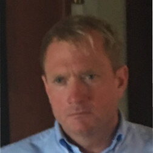

<h1 align="center">Hi there 👋</h1>

  <a href="https://github.com/KARLalpha4768">Github</a> • 
  <a href="https://www.linkedin.com/in/karldavid-data/">LinkedIn</a> • 
  <a href="mailto:alpha4768@gmail.com">Email</a>

I'm Karl David, a Senior Data Engineer and Solutions Architect with a deep passion for pushing the boundaries of edge computing and cloud infrastructure. Based in Rochester, NY, I bring a strong background in bridging physical hardware networks with scalable AI intelligence.

### 🚀 What I Do

I specialize in developing innovative solutions that blend complex data engineering, cloud-native infrastructure, and physical edge devices. My work is driven by a passion for leveraging AI to solve real-world logistical problems through automation and real-time telemetry.

*   **Data Engineering & Pipelines:** Engineered and deployed event-driven AWS data pipelines using Terraform and Databricks, processing massive streams of real-time GPS and spatial telemetry data. Built resilient ETL frameworks achieving zero-downtime synchronization.
*   **Edge AI & Computer Vision:** Expertise in real-time image processing and hardware orchestration. Developed an autonomous physical security VMS leveraging dual-PTZ IP cameras and Python Edge Relays, piping RTSP frames into Google's Gemini Vision API.
*   **Cloud Computing & Infrastructure:** Hands-on experience with AWS and Vercel, leveraging EC2, S3, Docker containerization, and Infrastructure as Code (IaC) to create highly scalable, secure, and cost-efficient enterprise environments. 
*   **Enterprise Web Apps:** Designed and optimized full-stack Next.js architectures, significantly improving operational efficiency by integrating automated time-tracking, fleet routing APIs, and live camera feeds into cohesive command centers.

### 🛠 Skills & Tools

*   **Programming Languages:** Python, TypeScript, SQL, Bash
*   **Data & AI:** PySpark, Databricks, Google Gemini Vision API, OpenCV, LLM Prompt Engineering
*   **Cloud Platforms:** AWS (S3, EC2, Lambda), Vercel, Terraform, Docker
*   **Frontend & Web:** React, Next.js, Tailwind CSS, Node.js
*   **Others:** REST APIs, Git, RTSP Stream Parsing, Linux/Unix

### 🌟 Core Achievements

*   **Analyzed 873,000+ Spatial Data Points:** Successfully replaced manual surveillance monitoring by orchestrating synchronized hardware sweeps and processing raw RTSP frames through Gemini Vision AI.
*   **Cut Forensic Audit Times by 60%:** Developed a custom financial reconciliation engine that completely automated the mapping of raw operational material costs to 40+ active enterprise client contracts.
*   **Integrated 43 Active Commercial Sites:** Streamed live GPS fleet telemetry (Yeti API) into a centralized Next.js dashboard, providing zero-latency situational awareness during extreme winter storm deployments.

### 📈 What I have worked on

My recent portfolio revolves around three major full-stack architectural deployments:

1.  **CamWatch (Amcrest Gemini Vision Platform):**
    *   *Focus: Edge AI, Python, Hardware Orchestration*
    *   Built the hardware integration layer to capture real-time RTSP frames from physical IP cameras.
    *   Designed the Python edge relay that securely bridges raw video feeds to a centralized cloud interface, processing threat intelligence via the Gemini Vision API.
2.  **Kham Enterprises Connected Operations Portal:**
    *   *Focus: Next.js, Vercel, API Integration, Frontend Architecture*
    *   Designed a role-based executive and employee portal featuring dynamic GPS fleet tracking and timecard submittals.
    *   Successfully combined live edge camera telemetry with commercial fleet routing maps into a single cohesive dashboard.
3.  **Automated Financial Reconciliation Engine:**
    *   *Focus: Databricks, PySpark, Complex State Management*
    *   Engineered an interactive P&L expense allocation wizard to perform deep forensic audits on operational costs (labor, fuel, materials).
    *   Built custom Python rendering pipelines to automatically generate high-fidelity PDF performance reports directly from JSON telemetry and Markdown logs.

### 📈 What I am currently working on

*   **Expanding CamWatch Capabilities:** Refining the synchronization protocols between the edge cameras and the cloud dashboard to achieve sub-second latency for live tracking and threat detection.
*   **AI for Operations:** Training and prompt-tuning multimodal AI solutions within the Kham Operations Portal to improve automated dispatcher responses and environmental assessment accuracy using raw visual data.
*   **Refactoring Core Microservices:** Breaking down legacy monolith Python data scripts for the Financial Engine into modular, containerized Docker microservices for enhanced reliability and easier CI/CD deployments.

### 🤝 Let's Collaborate!

I'm always on the lookout for exciting opportunities to collaborate on groundbreaking projects in Cloud Architecture, Data Engineering, and Edge AI. If you're working on something innovative and think we could create something amazing together, feel free to reach out!

*   **Email:** alpha4768@gmail.com
*   **LinkedIn:** [linkedin.com/in/karldavid-data](https://www.linkedin.com/in/karldavid-data/)

### ⚡ Fun Fact

When I'm not deep in code or driving my next cloud architecture project, you'll likely find me exploring cutting-edge advancements in physical security hardware or getting hands-on researching sustainable wetland amphibian habitats. I'm driven by a passion for continuous learning and thrive on tackling new architectural challenges head-on! Check out my repositories and see the work I’ve been doing! 🚀

